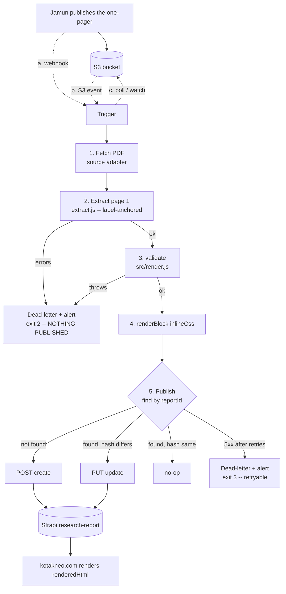

# INTEGRATION.md — deploying the research one-pager bot


> **Confirmed by the user (2026-08-13)**
> - **Strapi is v5.** Version detection is still left on `auto`: it will resolve
>   to v5 by itself, and nothing breaks if another environment differs. Pin
>   `STRAPI_API_VERSION=v5` once you are settled to skip the probe.
> - **Jamun is consumed by calling an API — a pull, not a webhook push.** The
>   shipped default `TRIGGER_MODE=once` matches that: a scheduler invokes the
>   bot, it asks Jamun what is new, processes it and exits. `poll` runs the same
>   loop in-process; `webhook` remains available if Jamun ever pushes.
>
> Both remain configuration, not assumptions baked into code.

How the Jamun PDF becomes an HTML block on kotakneo.com, and what an in-house
engineer has to decide, configure and run to make that happen.

**Companion documents.** `README.md` explains the renderer and the design of the
block. `schema.json` is the contract. `bot/README.md` is how to run the bot on a
laptop. `bot/.env.example` is the complete, annotated list of settings.

**Status.** The extractor has been **run against the real reference PDF** and its
output diffed field by field against `data/lenskart-2026-05-21.json` — results in
[§9](#9-verification-against-the-real-pdf). The publisher has been exercised
against a Strapi v4 and a Strapi v5 stub. It has **not** been run against a real
Kotak Strapi, because we have no access to one; [§11](#11-open-questions) lists
every assumption that follows from that.

---

## Contents

1. [Architecture](#1-architecture)
2. [Choose your setup](#2-choose-your-setup)
3. [Triggers](#3-triggers-what-starts-a-run)
4. [Strapi integration](#4-strapi-integration)
5. [Idempotency](#5-idempotency)
6. [Failure handling](#6-failure-handling)
7. [Deployment](#7-deployment)
8. [Security](#8-security)
9. [Verification against the real PDF](#9-verification-against-the-real-pdf)
10. [Rollout and rollback](#10-rollout-and-rollback)
11. [Open questions](#11-open-questions)

---

## 1. Architecture

```
  RESEARCH TEAM                          KOTAK SERVER (the box that runs Strapi)
  ─────────────                          ────────────────────────────────────────

  writes the                ┌───────────────────────────────────────────────────┐
  one-pager                 │                                                   │
      │                     │   TRIGGER   once │ webhook │ poll │ watch         │
      ▼                     │       │     (choose one; default: once)           │
   ┌───────┐   uploads      │       ▼                                           │
   │ JAMUN │ ─────────────► │   SOURCE    http │ s3 │ file │ dir  ── 1. FETCH   │
   └───────┘      PDF       │       │                                           │
      │                     │       ▼                                           │
      │  (a) webhook ─────► │   pdftext.js      PDF ──► lines[] with geometry   │
      │  (b) S3 event ────► │       │           (pdfjs-dist; PAGE 1 ONLY)       │
      │  (c) nothing        │       ▼                                           │
      ▼      (we poll)      │   extract.js      lines[] ──► JSON   ── 2. EXTRACT│
   ┌──────────────┐         │       │           label-anchored, cross-checked    │
   │  S3 bucket   │ ◄───────┤       ▼                                           │
   │ (public GET) │  fetch  │   render.js       validate()        ── 3. VALIDATE│
   └──────────────┘         │       │              │                            │
      │                     │       │              └── throws ──► REFUSE ───────┼──► dead-letter
      │ public URL          │       ▼                                           │    + alert
      │ (download button)   │   render.js       renderBlock({inlineCss:true})   │    + exit 2
      │                     │       │                                ── 4. RENDER│
      │                     │       ▼                                           │
      │                     │   PUBLISHER  strapi │ http │ file │ console       │
      │                     │       │      find-by-reportId ─► create or update │
      └────────────────────►│       │                                ── 5. PUBLISH
                            └───────┼───────────────────────────────────────────┘
                                    ▼
                              ┌──────────┐        ┌──────────────────┐
                              │  STRAPI  │ ─────► │  kotakneo.com    │
                              │ research │        │  renders         │
                              │ -reports │        │  renderedHtml    │
                              └──────────┘        └──────────────────┘
```



**The property that matters:** every arrow into Strapi passes through
`validate()` first, and `validate()` throws on a missing ticker, a bad date, an
unknown rating or an empty section. A half-parsed recommendation cannot reach
the website; it becomes a dead-letter file, an alert and a non-zero exit.

---

## 2. Choose your setup

Nothing about the target environment is compiled in. Each unknown below is one
config value with a default that works on a bare Linux box. Hand this table to
whoever owns the server.

| Decision | Options we support | Ships as | To change |
|---|---|---|---|
| **What starts a run** | one-shot CLI · HTTP webhook · object-store poll · directory watch | `once` — any scheduler can drive it | `TRIGGER_MODE` |
| **Where the PDF is** | https URL · S3 / any S3-compatible store · local file · watched directory | `http` — needs no credentials | `SOURCE_TYPE` |
| **Where output goes** | Strapi REST · any HTTP endpoint · files on disk · console | `strapi` | `PUBLISHER_TYPE` |
| **Strapi major version** | v4 (`id`, `data.attributes`) · v5 (`documentId`, flat) | `auto` — probed at first call | `STRAPI_API_VERSION` |
| **Strapi field names** | anything | the mapping in `README.md` | `STRAPI_FIELD_MAP` (JSON; `null` drops a field) |
| **Auth to the CMS** | bearer token · any scheme · arbitrary extra headers | `Authorization: Bearer …` | `STRAPI_AUTH_SCHEME`, `STRAPI_AUTH_HEADER`, `STRAPI_EXTRA_HEADERS` |
| **Scheduling** | systemd timer · cron · any external scheduler · long-running process | systemd timer (`bot/deploy/`) | see [§7](#7-deployment) |
| **Hosting** | bare host with Node · container | bare host; no Docker required | optional `bot/deploy/Dockerfile` |
| **PDF filename convention** | any | the Jamun convention | `FILENAME_PATTERN` (named-group regex) |
| **Section headings** | any | Rationale / Positives / Negatives / Risks / Outlook | `SECTION_MAP` |
| **How live to be** | dry-run · shadow · live | `dry-run` | `BOT_MODE` |

Runtime requirement, and the only one: **Node 18.17 or newer** (global `fetch`,
`AbortSignal.timeout`, `node:test`). Checked at boot with a message naming the
version and what to do. Node 20 LTS or 22 LTS recommended; both are inside
Strapi's own supported range, so the box already has a suitable runtime.

Install is `npm ci --omit=optional` in `bot/`, which fetches exactly one package.

### Why these dependencies, and no others

| Dependency | Why | Why not the alternative |
|---|---|---|
| `pdfjs-dist` 4.10.38 (~37 MB on disk) | Only real dependency. Pure JavaScript — no node-gyp, no system libraries, no compiler on the server. Mozilla-maintained. | `pdf-parse` wraps an unmaintained pdf.js fork. `pdf2json` is heavier and lossier. |
| *(none)* for S3 | ~70 lines of SigV4 on `node:crypto`, verified against AWS's published test vector. Works against MinIO/Ceph by setting `S3_ENDPOINT`. | `@aws-sdk/client-s3` is ~15 MB and hundreds of transitive packages for two request shapes — a real supply-chain review burden. |
| *(none)* for HTTP | Global `fetch` since Node 18. | `axios`/`node-fetch` add nothing here. |
| *(none)* for the webhook | `node:http`. | Express is a framework and a patch stream for one endpoint. |
| *(none)* for tests | `node:test`. | Jest/Mocha are dev-dependency trees for the same result. |
| *(none)* for config | ~20 lines of `KEY=VALUE` parsing. | `dotenv` for that is not worth a dependency. |

`@napi-rs/canvas` is an **optional** dependency of `pdfjs-dist` and is a native
module. It is used only for *rendering* pages to a bitmap. Text extraction does
not need it, so `--omit=optional` leaves it out and the install stays pure JS.
The bot mutes the resulting "cannot load canvas" notice at import and lets every
other pdf.js message through.

**No Python is required.** The original extraction notes used PyMuPDF; this
pipeline replaces it with `pdfjs-dist` so the server needs one runtime. Verified
by running both against the reference PDF and comparing (see
[§9](#9-verification-against-the-real-pdf)) — pdf.js is in fact the stricter of
the two, because it surfaces hidden text PyMuPDF silently drops.

---

## 3. Triggers: what starts a run

### Measured facts about the reference bucket

Probed on 2026-08-13 against
`https://ks-oncloudpublic-reports.s3.ap-south-1.amazonaws.com/`:

| Request | Result |
|---|---|
| `GET /jaamoon-pdf-files/131440_1_….pdf` | **200**, 337 198 bytes, `application/pdf` |
| `HEAD` the same object | **200**, `Last-Modified: Thu, 21 May 2026 03:23:04 GMT`, `ETag`, `x-amz-storage-class: STANDARD_IA` |
| `GET /?list-type=2&prefix=jaamoon-pdf-files/` | **403 `AccessDenied`** |
| `GET` with `Range: bytes=0-99` | **206** |

**Objects are publicly readable; the bucket is not publicly listable.** That
single fact decides the trigger discussion: a "poll the S3 prefix" fallback
cannot work anonymously. It needs credentials with `s3:ListBucket`, or a
different discovery mechanism. `config.js` refuses to start with
`TRIGGER_MODE=poll` + `SOURCE_TYPE=s3` + no credentials, and says why, rather
than running every five minutes and finding nothing.

### The options

#### (a) Jamun webhook → HTTP listener — **lowest latency, needs Jamun changed**

`TRIGGER_MODE=webhook`. `node:http`, one route, HMAC-SHA256 over the raw body
compared in constant time.

```
POST /jamun/report          x-jamun-signature: sha256=<hex>
{"url": "https://…/131440_1_Lenskart_Solutions__One_Pager_Q4FY26_Result_Update.pdf"}
```
Also accepts `key`, `path` or `filename`. `?wait=1` returns the outcome
synchronously (useful while testing); otherwise `202` and the work continues in
the background. `GET /healthz` returns publisher reachability.

| | |
|---|---|
| Good | Publishes within seconds. Jamun knows exactly which report is new — no discovery, no cursor, no polling window. |
| Bad | Requires a change to Jamun, an open port, and a firewall/proxy rule. Needs a retry policy **on the Jamun side**: if the bot is down, the event is lost unless Jamun re-delivers. Long-running process to supervise. |
| Mitigation | Pair it with a low-frequency `poll` or `watch` as a safety net, so a dropped webhook is picked up within the hour rather than never. |

#### (b) S3 event notification — **good if the bucket is ours to configure**

S3 → SNS/SQS/Lambda → HTTP POST to the same webhook endpoint. From the bot's
point of view this is identical to (a); only the sender changes.

| | |
|---|---|
| Good | No change to Jamun at all. AWS retries delivery for us. Fires on the actual object write, so it cannot miss a report. |
| Bad | Needs write access to the bucket's notification configuration and a way for AWS to reach an internal endpoint (an SNS HTTPS subscription through the perimeter, or SQS + a poller inside). Adds AWS components to change-control. |
| Note | If SQS is used instead of an HTTPS push, add a small `sqs` source/trigger. The trigger registry exists for this: one file, one `registerTrigger` line. |

#### (c) Scheduled poll — **the fallback, but not over anonymous S3**

`TRIGGER_MODE=poll`, `SOURCE_TYPE=s3`, credentials required. Paginated
`ListObjectsV2`, filtered to `.pdf`, ordered by `LastModified`, with a persisted
cursor (`state/cursor.json`) that stores the last timestamp *and* the ids seen at
that timestamp — S3 timestamps are whole-second, so two objects can share one.

| | |
|---|---|
| Good | Needs nothing from Jamun. Survives restarts without reprocessing or skipping. |
| Bad | **Requires IAM credentials** (`s3:ListBucket` + `s3:GetObject`) — measured 403 above. Latency is the poll interval. Costs a `ListObjectsV2` per interval. |

#### (d) Directory watch — **fewest prerequisites of all**

`TRIGGER_MODE=watch`, `SOURCE_TYPE=dir`. Jamun, an SFTP drop, an rsync job or a
cron'd `aws s3 sync` puts PDFs in a directory; the bot consumes them and moves
them to `SOURCE_ARCHIVE_DIR`.

| | |
|---|---|
| Good | No inbound port, no outbound network, no credentials, no bucket policy. `fs.watch` gives near-instant latency; a periodic sweep runs regardless, because `fs.watch` is unreliable on NFS/CIFS and coalesces under load. Files whose mtime is under 5 s old are skipped, so a half-written upload is never parsed. |
| Bad | Something else has to put the file there. Needs a writable spool and archive directory. |

#### (e) One-shot — **the default, and what replaces the existing 09:00 cron**

`TRIGGER_MODE=once`. Process the reference given, exit with a meaningful code.
Assumes nothing: systemd timers, cron, Autosys, Control-M, Jenkins or a person
can all drive it, and the exit code is the entire interface.

### Recommendation

**Ship (e) one-shot on a systemd timer, and add (a) the webhook once Jamun can
be changed.**

Reasoning: the one-shot replaces the existing 09:00 cron with the same
operational shape the team already runs, needs no credentials, no open port and
no bucket-policy change, and is therefore deployable this week. It is also the
only mode that works when nothing about the environment is known yet.

When Jamun can post a webhook, add it for latency and keep the timer running as
a safety net — a missed webhook then costs a few hours, not a day. Prefer (b)
over (a) if the bucket's notification config is ours, since AWS handles retries.
Choose (c) only if credentials are available; otherwise (d) is a strictly better
fallback than a poll that cannot list.

**One thing the one-shot needs that the current cron does not:** *which* report
to process. It takes a URL, an S3 key or a path. If the 09:00 job already knows
the PDF URL — it puts it on the recommendation page today — pass the same value:

```bash
node run.js --live --url "$PDF_URL"
```

If it does not, use (d): have the existing job drop the PDF in a spool directory
and point the bot at that. This is the single largest unknown in the design —
see [§11](#11-open-questions), Q1.

---

## 4. Strapi integration

### Content type

Collection type **`research-report`** (plural API id `research-reports`).

| Attribute | Type | Settings | Source |
|---|---|---|---|
| `reportId` | Text (short) | **required, unique** | `reportId` — from the filename (`131440_1`) |
| `stockName` | Text (short) | required | `stock.name` |
| `ticker` | Text (short) | required | `stock.ticker` |
| `slug` | Text (short) | **not unique**, indexed | `stock.slug` — joins the block to its page |
| `reportDate` | Date | required | `publishedAt` — **not** Strapi's `publishedAt` |
| `reportType` | Enumeration | `Result Update`, `Company Update`, `Initiating Coverage`, … | `report.type` |
| `period` | Text (short) | | `report.period` |
| `rating` | Enumeration | `BUY ADD REDUCE SELL NR SUBSCRIBE RS NA NM` | `recommendation.rating` |
| `cmp` | Decimal | required | `recommendation.cmp` |
| `fairValue` | Decimal | nullable | `recommendation.fairValue` |
| `sourcePdf` | Text (long) | | `sourcePdf` |
| `payload` | JSON | | the whole validated document |
| `renderedHtml` | Rich text (long) / Text (long) | | `renderBlock({inlineCss:true})` |
| `contentHash` | Text (short) | | sha256 of payload + html + publishState |
| `publishState` | Enumeration | `shadow`, `live` | set by `BOT_MODE` |

Three departures from the table in `README.md`, each deliberate:

> **⚠️ `publishedAt` is a reserved Strapi field.** With Draft & Publish enabled,
> Strapi owns `publishedAt` — it is a datetime that controls whether the entry is
> live. Writing a report date into it would publish or unpublish the entry as a
> side effect of storing a date. The bot maps the report date to **`reportDate`**
> and *refuses* to write to any reserved name (`id`, `documentId`, `createdAt`,
> `updatedAt`, `publishedAt`, `createdBy`, `updatedBy`, `locale`,
> `localizations`), logging why. If your content type already uses `publishedAt`
> for the report date, rename it before going live.

> **⚠️ `slug` must not be a UID field.** `README.md` suggests UID; UID is unique,
> and a stock gets a new report every quarter. The second report for Lenskart
> would fail to save. Use a plain indexed Text field. `reportId` is the unique
> key.

> **`contentHash` and `publishState` are additions.** `contentHash` makes a
> re-run a genuine no-op instead of a pointless revision; `publishState` is what
> makes shadow mode possible without Draft & Publish.

**Recommendation: turn Draft & Publish OFF for this content type** and let
`publishState` govern visibility, with the frontend filtering
`publishState=live`. This sidesteps the `publishedAt` collision, the v4/v5
publish-endpoint differences, and gives shadow mode for free. If Draft & Publish
must stay on, set `STRAPI_DRAFT_AND_PUBLISH=on` — the client then queries drafts
explicitly on v5 — and **verify the publish step against your actual Strapi
version before going live**; we could not test that path (see
[§11](#11-open-questions), Q4).

### The exact REST calls

`STRAPI_URL=https://cms.internal.kotak.com`, `STRAPI_COLLECTION=research-reports`.

**Find** (both versions, identical request):

```http
GET /api/research-reports?filters[reportId][$eq]=131440_1&pagination[pageSize]=2
Authorization: Bearer <STRAPI_API_TOKEN>
Accept: application/json
```

```jsonc
// v4                                     // v5
{ "data": [ { "id": 12,                   { "data": [ { "id": 12,
    "attributes": { "reportId": "…" } } ]     "documentId": "abc123xyz",
}                                             "reportId": "…" } ] }
```

**Create** (both versions, identical):

```http
POST /api/research-reports
Content-Type: application/json
Authorization: Bearer <token>

{ "data": { "reportId": "131440_1", "stockName": "Lenskart Solutions",
            "ticker": "LENSKART", "slug": "lenskart-solutions-share-price",
            "reportDate": "2026-05-21", "reportType": "Result Update",
            "period": "Q4FY26", "rating": "ADD", "cmp": 487, "fairValue": 560,
            "sourcePdf": "https://…pdf", "payload": { … }, "renderedHtml": "<style>…",
            "contentHash": "b87b50e075dc…", "publishState": "live" } }
```

**Update — the one call that differs:**

```http
PUT /api/research-reports/12           ← v4: the numeric id
PUT /api/research-reports/abc123xyz    ← v5: the documentId
```

Using the numeric `id` against v5 returns 404. This is the single most common
v4→v5 migration break, and the reason for auto-detection.

### Version auto-detection

```
first API call
      │
      ├─ response entry has `documentId`            → v5
      ├─ response entry has an `attributes` wrapper → v4
      └─ collection is empty (tells us nothing)     → assume v5 + WARN loudly
```

Cached for the process; re-adopted automatically if a later response arrives in
the other shape (a mid-flight upgrade). `STRAPI_API_VERSION=v4|v5` skips
detection entirely. The empty-collection warning names the fix:

> The collection is empty, so the Strapi major version could not be detected from
> a response. Assuming v5. If this Strapi is v4, set `STRAPI_API_VERSION=v4` —
> otherwise the first update will 404.

Both paths are tested against a stub that speaks each envelope, including that
v4 is addressed by `id` and v5 by `documentId`.

### Auth

`Authorization: Bearer <token>` by default. Because we do not know what fronts
Strapi:

- `STRAPI_AUTH_SCHEME` — set to `Token`, or empty for a bare token.
- `STRAPI_AUTH_HEADER` — if a gateway expects something other than `Authorization`.
- `STRAPI_EXTRA_HEADERS` — arbitrary JSON, for a WAF key, an API-gateway header
  or a tracing id. Values whose names look like secrets are masked in logs.
- `STRAPI_API_PREFIX` — if Strapi is mounted under a path prefix.
- mTLS: terminate at the reverse proxy. The bot deliberately holds no client
  certificate; that is the platform's lifecycle to manage, not the bot's.

Create a **custom API token** (Settings → API Tokens → Custom) with `find`,
`create` and `update` on `research-report` **only**. Not `Full access`. Not
`delete` — the bot never deletes, so the token should not be able to.

---

## 5. Idempotency

Re-running for the same `reportId` must update, never duplicate. Three layers:

1. **Find, then create-or-update**, keyed on `reportId`.
2. **`unique: true` on `reportId` in the content type.** Two concurrent runs can
   both find nothing and both try to create. The database constraint makes the
   loser fail with 400; the client catches that, re-finds, and updates. Without
   the constraint the race silently leaves two entries.
3. **A single-instance lock** (`state/bot.lock`, pid + hostname, stale locks
   taken over). Not racing is cheaper than recovering from a race. Exit code 5.

If Strapi ever returns more than one entry for a `reportId`, the client
**throws** rather than picking one:

> Strapi holds 2 entries with reportId="131440_1". Idempotency is broken:
> de-duplicate them and add `"unique": true` to that attribute in the content type.

**Content hash.** `contentHash` = sha256 over the canonical JSON of the payload,
the rendered HTML, and `publishState`. If the stored hash matches, the bot logs
`unchanged` and issues **no write** — a re-run costs one GET. Including
`publishState` in the hash is what makes the shadow→live flip a real update
rather than a skipped no-op. (This was a genuine bug found during testing.)

Verified against both stubs:

```
--dry-run  DRY RUN -- nothing was written
--shadow   action=created   id=doc1  publishState=shadow      (v4: id=1)
--shadow   action=unchanged id=doc1  publishState=shadow
--live     action=updated   id=doc1  publishState=live
--live     action=unchanged id=doc1  publishState=live
```

---

## 6. Failure handling

### The rule

> **A half-parsed research recommendation is never published.**
>
> A missed run is a stale page and a pager. A wrong fair value on a live page is
> a mis-communicated investment recommendation from a regulated entity. These
> are not comparable, so every ambiguity resolves towards *refuse and alert*.

The extractor **never guesses a number**. No label, two labels, or one label with
two candidate values ⇒ error, nothing published. It has no "best effort" mode and
no fallback to a previous value.

### What happens, case by case

| Failure | Detected by | Behaviour | Exit | Retry? |
|---|---|---|---|---|
| **Extraction error** (missing/ambiguous CMP, unparseable date, unknown rating, no sections, orphaned bullets, name/filename mismatch) | `extract.js` returns `ok:false` | Nothing published. Dead-letter record + PDF written. Alert. | **2** | No — a human must look |
| **`validate()` throws** | `src/render.js` | Same as above, with the validator's message | **2** | No |
| **Malformed PDF** (encrypted, truncated, an HTML error page served as `.pdf`) | `pdftext.js` header check + pdf.js | `Source is not a PDF (no %PDF- header). This is usually an S3 error page, an HTML login redirect, or a truncated download.` | **2** | No |
| **Scanned / image-only PDF** | zero text on page 1 | `Page 1 produced no text. The PDF is probably a scan or image-only; this pipeline does not OCR.` | **2** | No |
| **S3 404 / 403** | source adapter | 4xx is **not** retried — being wrong is not being early | **3** | Next scheduled run |
| **S3 5xx, timeout, DNS, TLS, reset** | `lib/http.js` | 4 retries, exponential backoff with full jitter (0.5 s → 20 s cap), `Retry-After` honoured | **3** if all fail | Yes, automatically |
| **Strapi 5xx / 429** | `lib/http.js` | Same retry policy | **3** | Yes |
| **Strapi 401 / 403 / 404** | `strapi.js` | No retry; the message names the likely cause (expired token, missing permission, wrong plural API id) | **3** | No — fix config |
| **Duplicate entries in Strapi** | `findByReportId` | Throws with the de-duplication instruction | **3** | No |
| **Bad config** | `config.js` at boot | Every problem listed at once, with variable names and example values | **4** | No |
| **Another instance running** | lock file | Exits immediately | **5** | Yes, next run |

**Warnings** (stale report date, derived slug, unknown section, possible bullet
truncation, upside inconsistent with the rating band, stray rating text) do not
block by default — they are logged at WARN and stored in the outcome. Set
`BOT_FAIL_ON_WARNING=true` to escalate every warning to a refusal; that is the
right setting once a few weeks of real warnings have been reviewed.

### Dead-letter

`$BOT_STATE_DIR/dead-letter/<timestamp>__<reportId>.json` plus the `.pdf`
alongside it, so a failure can still be reproduced after the object has been
rotated out of the bucket. Each record carries the errors, the warnings, the
partial extraction, and the `evidence` block — which line each field came from —
so a disputed figure can be traced back to the page.

### Alerting — no external SaaS anywhere

Four independent channels, none of which leaves the bank:

1. **Exit code** → `OnFailure=kotak-research-bot-alert@%n.service`
   (`bot/deploy/kotak-research-bot-alert@.service`), which mails the last 60 log
   lines and the newest dead-letter record. Under cron, `MAILTO` does the same.
2. **ERROR log lines** → journald → whatever ships logs. `BOT_LOG_FORMAT=json`
   emits one JSON object per line.
3. **Dead-letter files** → alert on a non-empty directory from existing monitoring.
4. **`ALERT_WEBHOOK_URL`** → one POST to an *internal* endpoint with the
   failures, their codes and the dead-letter paths. A failure of the alert
   channel is logged and never masks the original failure.

**Who gets alerted.** Exit 2 (refused to publish) is a *content* problem — the
research/content owner must look at the PDF, and the page keeps yesterday's
content until they do. Exit 3 (publish failed) and exit 4 (config) are
*platform* problems — the team that owns the server and Strapi. Route them
differently; they have different people and different urgency.

---

## 7. Deployment

No Docker assumption. The bot is Node plus one pure-JS package and runs on any
Linux host.

```bash
# 1. code
install -d -o kotakbot -g kotakbot /opt/kotak-research-bot
# deploy the repository there: bot/, src/, schema.json
cd /opt/kotak-research-bot/bot && npm ci --omit=optional

# 2. state (lock, poll cursor, dead-letter)
install -d -o kotakbot -g kotakbot -m 0750 /var/lib/kotak-research-bot

# 3. configuration and secrets
install -d -o root -g kotakbot -m 0750 /etc/kotak-research-bot
install -o root -g kotakbot -m 0640 bot.env /etc/kotak-research-bot/bot.env

# 4. prove the environment before trusting it
sudo -u kotakbot node run.js --doctor
```

`--doctor` output on a working host:

```
ok    node runtime          v22.22.2 on linux/x64
ok    global fetch          function
ok    pdfjs-dist installed  4.10.38
ok    renderer (src/render.js)  renderBlock, renderStandalone, validate, computeUpside, …
ok    writable: /var/lib/kotak-research-bot
ok    writable: /var/lib/kotak-research-bot/dead-letter
ok    trigger               one-shot (process the given references and exit)
ok    source                https source (…/jaamoon-pdf-files/<key>)
ok    publisher             Strapi (version auto-detected) at https://cms…/api/research-reports
ok    publisher reachable   {"ok":true,"version":"v5","detectedFrom":"probe","ms":55}
```

### Scheduling — systemd timer (preferred)

`bot/deploy/kotak-research-bot.service` + `.timer`. Type `oneshot`, so systemd
tracks the exit code and `OnFailure=` fires. The timer uses
`OnCalendar=Mon..Fri *-*-* 09:00:00 Asia/Kolkata`, `RandomizedDelaySec=120` to
spread load off the exact minute, and `Persistent=true` so a run missed because
the box was down happens at next boot instead of being skipped silently.

Preferred over cron because: the exit code drives alerting natively; journald
gives structured logs with no logrotate to configure; the sandboxing directives
below are free; and `systemctl list-timers` answers "did it run" honestly.

The unit ships with `NoNewPrivileges`, `ProtectSystem=strict`, `PrivateTmp`,
`MemoryDenyWriteExecute`, an empty `CapabilityBoundingSet`, a `@system-service`
syscall filter, and `ReadWritePaths` limited to the state directory. This process
parses untrusted binary input from the internet; it should be able to do
approximately nothing else.

`bot/deploy/crontab.example` is the cron equivalent (with `CRON_TZ` and
`MAILTO`) for hosts where cron is easier to change-control.
`bot/deploy/logrotate.example` covers file logging.

### Long-running modes

For `TRIGGER_MODE=webhook|poll|watch`, change `Type=oneshot` to `Type=simple`,
drop the timer, add `Restart=on-failure` / `RestartSec=30`, and
`systemctl enable --now kotak-research-bot.service`. Both `SIGTERM` and `SIGINT`
shut down cleanly mid-cycle.

### Logs

`journalctl -u kotak-research-bot -f`, or a file plus the logrotate snippet.
`BOT_LOG_FORMAT=json` for a shipper. Every line carries the report reference; URLs
are logged with the query string stripped; secrets are never logged.

### Health check

- One-shot: `systemctl list-timers`, plus the exit code of the last run.
- Webhook: `GET /healthz` → `{"ok":true,"mode":"live","publisher":{…}}`, `503`
  when the CMS is unreachable.
- Any mode, on demand: `node run.js --doctor` (exit 0 / 4).
- Freshness alarm: `contentHash` and `reportDate` in Strapi make "no report
  published today" a query the existing monitoring can run — the check that
  actually matters, because a bot that dies quietly looks the same as a day with
  no reports.

### Container (optional)

`bot/deploy/Dockerfile` — `node:22-bookworm-slim`, non-root uid 10001, state on a
volume, build context is the repository root because the renderer lives in
`src/`. Offered only if the platform team would rather ship an image.

---

## 8. Security

**All PDF-extracted text is untrusted input.** It is authored outside this
system, arrives as binary, and goes onto a public page.

- `src/render.js` escapes `& < > " '` on every value that reaches the DOM, and
  `escUrl()` allows only `http(s):`, `mailto:`, `tel:`, `/` and `#` — a
  `javascript:` or `data:` PDF URL **suppresses the download button** rather than
  rendering a dead or dangerous link. `npm test` at the repository root covers
  this; `bot/test/pipeline.test.js` re-proves it end to end by putting
  `` and `<script>` into a bullet and asserting they
  come out escaped.
- The JSON-LD block escapes every `<` as `\u003c`, so a `</script>` in extracted text cannot break out of the script element.
- pdf.js runs with `isEvalSupported: false`, `disableFontFace: true`,
  `useSystemFonts: false` — no font-program evaluation, no filesystem probing.
- Input is size-capped (`SOURCE_MAX_BYTES`, 25 MiB) and header-checked before
  parsing.
- Directory sources reject any path that resolves outside `SOURCE_DIR`.

**Secrets.** Never in the repository; never on the command line (`ps` is world
readable). Put them in an `EnvironmentFile` owned by `root:kotakbot`, mode
`0640`. `--print-config` masks tokens as `<set:N chars>`, header values whose
names match `auth|token|key|secret|cookie` become `<redacted>`, and logged URLs
have query strings stripped.

**Reproducible installs.** `bot/package-lock.json` is tracked (the root
`.gitignore` scopes its lockfile rule to `/package-lock.json`, the root only).
That lockfile is what pins `pdfjs-dist` to an audited version and makes
`npm ci --omit=optional` reproducible on the build host; keep it committed, and
review any change to it as a dependency change.

**API token.** Custom token, `find`/`create`/`update` on `research-report` only.
No `delete`. Rotate on a schedule (quarterly is typical) and on any staff change:
create the new token, update the `EnvironmentFile`, run `--doctor` to prove it
works, then revoke the old one — zero downtime, because tokens are independent.
Strapi tokens can carry an expiry; set one so a forgotten token dies on its own.

**TLS.** `STRAPI_URL` and `SOURCE_URL` must be `https`. The bot warns on a plain
`http` source URL. Certificates are validated by Node's default trust store — do
**not** set `NODE_TLS_REJECT_UNAUTHORIZED=0`; if an internal CA is in play, point
`NODE_EXTRA_CA_CERTS` at its bundle. The webhook listener speaks plain HTTP and
binds to `127.0.0.1` on purpose: TLS termination belongs to nginx/Apache, not to
a 200-line bot. It warns if bound to a non-loopback address.

**Webhook authentication.** HMAC-SHA256 over the raw body, constant-time
compare, `WEBHOOK_SECRET` required unless `WEBHOOK_AUTH_MODE=none` (only
acceptable when something in front already authenticates). Bodies are capped at
64 KiB. Verified: unsigned → 401, wrong signature → 401, correct HMAC → 200.

**Least privilege.** Dedicated `kotakbot` user, no shell needed, no capabilities,
write access to exactly one directory, and a syscall filter. Outbound network is
limited to the S3 host and the CMS — worth enforcing at the firewall too.

---

## 9. Verification against the real PDF

The reference PDF **was downloaded and processed**. It is 4 pages, 337 198 bytes,
PDF 1.7. Everything below is measured output, not expectation.

```bash
node bot/run.js --dry-run \
  --url https://ks-oncloudpublic-reports.s3.ap-south-1.amazonaws.com/jaamoon-pdf-files/131440_1_Lenskart_Solutions__One_Pager_Q4FY26_Result_Update.pdf
```

### Field by field, against `data/lenskart-2026-05-21.json`

| Field | Reference | Extracted | |
|---|---|---|---|
| `schemaVersion` | `1.0` | `1.0` | ✅ |
| `reportId` | `131440_1` | `131440_1` | ✅ |
| `sourcePdf` | the S3 URL | the S3 URL | ✅ |
| `publishedAt` | `2026-05-21` | `2026-05-21` | ✅ |
| `stock.name` | `Lenskart Solutions` | `Lenskart Solutions` | ✅ |
| `stock.ticker` | `LENSKART` | `LENSKART` | ✅ |
| `stock.slug` | `lenskart-solutions-share-price` | `null`, or exact with a ticker map | ⚠️ **not in the PDF** |
| `stock.isin` | absent | `null` (or from the ticker map) | ⚠️ not in the PDF |
| `report.type` | `Result Update` | `Result Update` | ✅ (filename, corroborated on page 1) |
| `report.period` | `Q4FY26` | `Q4FY26` | ✅ |
| `report.template` | `One Pager` | `One Pager` | ✅ |
| `recommendation.rating` | `ADD` | `ADD` | ✅ |
| `recommendation.cmp` | `487` | `487` | ✅ |
| `recommendation.fairValue` | `560` | `560` | ✅ |
| `recommendation.currency` | `INR` | `INR` | ✅ (from the `Rs.` mark) |
| `recommendation.holdingPeriod` | `12 months` | `12 months` | ✅ |
| `sections[0]` Rationale | 5 bullets | 5 bullets, **byte-identical** | ✅ |
| `sections[1]` Positives | 6 bullets | 6 bullets, **byte-identical** | ✅ |
| `sections[2]` Negatives | 1 bullet | 1 bullet, **byte-identical** | ✅ |
| `sections[*].icon` | absent | `rationale`/`positive`/`negative` | ✅ cosmetic — same rendered output |
| `abbreviations` | curated | **verbatim from the PDF** | ⚠️ **differs — see below** |
| `attribution` | one space added | **verbatim from the PDF** | ⚠️ one character |

All 12 bullets across the three sections match the hand transcription exactly,
including the hyphenated line break (`pressure on cross-` + `currency rates.` →
`pressure on cross-currency rates.`) and the curly apostrophe in `India’s`.

Rendering both documents through `src/render.js --inline-css` produces
**1021 lines each, differing on exactly 2** — the two rows marked ⚠️ below.
Hero, KPIs, the rating gauge, all bullets and the JSON-LD are identical.
`computeUpside(487, 560)` = **+15.0%**, which lands in the ADD band, matching the
report's own rating.

### The three differences, explained

**1. `stock.slug` / `stock.isin` — not in the PDF at all.** Page 1 contains no
URL slug and no ISIN. The bot will not invent one, because a wrong slug attaches
the block to the wrong page. Options, in order of preference:

- `BOT_TICKER_MAP=/etc/kotak-research-bot/tickers.json` — a lookup table
  (`bot/ticker-map.example.json`). With `{"LENSKART":{"slug":"lenskart-solutions-share-price"}}`
  the extracted value is **exactly** the reference. This is the recommended path.
- `SLUG_TEMPLATE={name}-share-price` — derives `lenskart-solutions-share-price`
  from the stock name, which happens to be right here. Always emits a warning,
  because "happens to be right" is not a guarantee.
- Neither — `slug` is `null` with a warning. The block still renders; only the
  cross-link is missing.

Better still: if Strapi already holds the recommendation pages, resolve the slug
by ticker at publish time. That needs the existing content type's shape, which we
do not have — [§11](#11-open-questions), Q3.

**2. `abbreviations` — the reference was hand-curated.** The PDF prints:

```
(EBITDA - Earnings Before Interest, Taxes, Depreciation, and Amortization, EPS- Earning
 Per Share, CAGR - Compound Annual Growth Rate, FCF – Free Cash Flow)
```

The reference JSON normalises the separators to semicolons, fixes `EPS-` and
`Earning Per Share`, and **adds four terms the PDF does not define** (`DCF`,
`bps`, `yoy`, and a trailing full stop). The bot emits what the report says. That
is the correct default for a regulated publication — we publish the research
team's words, and the extraction is auditable against the source. If the curated
glossary is wanted, it is editorial and belongs in Strapi or in a static glossary
the renderer appends, not in the extractor.

**3. `attribution` — one missing space, present in the source.** The PDF really
does read `…shrikant.chouhan@kotak.com).Readers who wish…` with no space after
the full stop. The reference adds one. The bot reproduces the report verbatim.
Auto-correcting punctuation inside a published financial disclaimer is exactly
the kind of silent edit that fails an audit, so it is not done. If the space is
wanted, fix it in the PDF template — it will then be right everywhere.

### Warnings raised on the reference report

```
WARN REPORT_STALE       Report is dated 2026-05-21, 84 days ago (limit 7).
                        Check this is not a re-run over an old file.
WARN STRAY_RATING_TEXT  Page 1 also contains rating-like text that was ignored:
                        ") - SELL". This is usually invisible leftover template
                        text; confirm the published rating is correct.
NOTE Joined a line-break hyphen: "...sure on cross-currency rates..."
```

`REPORT_STALE` fires only because we are processing a May report in August; on
the day of publication it would not.

### 🔴 `") - SELL"` — a real hazard in the real PDF

Page 1 of the reference report contains **invisible leftover template text**
reading `") - SELL"`, in the same 20pt font as the headline, positioned under the
"Result Update" band. It is clipped out of view, so a human reading the PDF never
sees it.

**PyMuPDF silently drops it. pdf.js does not.** The original extraction notes
were written against PyMuPDF, so this never surfaced. It matters because the most
obvious extraction rule — "find a line containing a rating word and a dash" —
returns **SELL** for a report that is an **ADD**. On a bank's public
recommendation page.

Three independent defences:

1. A headline must match `Name (TICKER) - RATING` **in full**. `") - SELL"` has
   no company name and no ticker in parentheses, so it is not a candidate.
2. If several complete headlines are present, the one whose stock name agrees
   with the filename wins; if two conflicting ones both agree, the bot
   **refuses** rather than choosing.
3. Any rating-shaped text that was ignored is reported as `STRAY_RATING_TEXT`, so
   a human is told it exists.

There is a test for each, and the fixture in `bot/test/fixtures/` preserves the
real line so it can never regress.

### Test suite

```
$ cd bot && npm test
# tests 81   # pass 79   # fail 0   # skipped 2   # duration_ms ~1200
```

81 tests: extraction against the real captured page (33), Strapi v4/v5 and field
mapping (17), config validation (21), end-to-end pipeline including HTML-escaping
of hostile PDF text (10). 79 run with no network and no PDF; the 2 skipped are the
full PDF→publish runs, which need a copy of a real report:

```
$ BOT_TEST_PDF=/path/to/131440_1_Lenskart_Solutions__One_Pager_Q4FY26_Result_Update.pdf npm test
# tests 81   # pass 81   # fail 0
```

The repository's own suite is untouched and still passes (`npm test` at the root:
**38 passed, 0 failed**).

---

## 10. Rollout and rollback

### Stage 0 — dry run (no writes anywhere)

```bash
node bot/run.js --dry-run --url "<yesterday's PDF>" --out ./review
```

Nothing is written to any system. Prints the JSON, renders the HTML into
`./review/`, reports every warning. **Exit criterion:** run every report from the
last two weeks; a human compares each rendered block with the PDF. Zero errors,
and every warning understood. This is the stage that catches template variants —
NR reports with no fair value, different section headings, a two-line stock name.

### Stage 1 — shadow (writes, but the site ignores it)

```bash
BOT_MODE=shadow node bot/run.js --url "<today's PDF>"
```

Writes to Strapi with `publishState=shadow`. The frontend filters
`publishState=live`, so nothing appears on the site. Run the timer daily
alongside the existing 09:00 cron, which keeps doing its job. **Exit criterion:**
two weeks, every report present in Strapi, the content team happy with the blocks
in the Strapi preview, no unexplained errors or dead-letters.

### Stage 2 — live, one page

Flip `BOT_MODE=live` but have the frontend render `renderedHtml` on **one**
recommendation page. The bot writes `publishState=live` for everything; only that
page reads it. **Exit criterion:** one week, checked daily on desktop and mobile,
light and dark.

### Stage 3 — live, everywhere

Frontend renders the block wherever a matching `research-report` exists.
Consider `BOT_FAIL_ON_WARNING=true` once the real warning profile is known.

### Stage 4 — retire the old cron

Only after stage 3 has been stable for a month, and only if the bot has taken
over updating the PDF link, stock name and price. **Until then run both** — they
touch different fields and do not conflict.

### Rollback

| Level | Action | Effect | Time |
|---|---|---|---|
| Stop publishing | `systemctl stop kotak-research-bot.timer` | The page keeps its last good block; the old cron keeps updating the link | seconds |
| Hide the blocks | frontend stops rendering `renderedHtml` | Site reverts to today's behaviour; the data stays in Strapi | one deploy |
| Un-publish one report | set `publishState=shadow` on that entry in Strapi | Just that block disappears | seconds |
| Full revert | `BOT_MODE=dry-run` + frontend rollback | Nothing writes, nothing renders | minutes |

No rollback needs a database migration: `research-report` is a new collection
that nothing else depends on, and `payload` keeps the validated JSON, so any
future template change can re-render historical reports without re-parsing a
single PDF.

---

## 11. Open questions

Everything below was assumed because it could not be verified from here. Each has
a **default that is safe if the assumption is wrong**, but each deserves an
answer before stage 2.

**Q1 — How does the bot learn *which* PDF to process? (biggest unknown)**
Assumed: the existing 09:00 cron already knows the PDF URL, since it puts that
link on the page today, and can pass it as `--url`.
*If wrong:* use `TRIGGER_MODE=watch` over a spool directory (needs no
credentials, no port, no Jamun change), or get IAM credentials with
`s3:ListBucket` and use `TRIGGER_MODE=poll`. **Anonymous S3 listing is confirmed
403, so "just poll the prefix" is not available.**

**Q2 — Can Jamun call a webhook, and is the bucket ours to configure?**
Assumed: neither, for now — hence the one-shot default. Either one improves
latency from hours to seconds; the listener is written and tested.

**Q3 — What identifies a recommendation page: `slug`, `ticker`, or something
else?** Assumed a `slug` like `lenskart-solutions-share-price`, supplied by a
ticker map. Not in the PDF, so the bot will not invent it. *If the existing
content type keys on something else,* say so and the publisher resolves it at
publish time instead — the field map already makes that a config change.

**Q4 — Strapi major version, and is Draft & Publish on?**
Auto-detected at runtime; both paths tested against a stub. **Not tested against
a real Kotak Strapi.** We recommend Draft & Publish **off** for this content
type, with `publishState` governing visibility, because it sidesteps the
`publishedAt` collision and the v4/v5 publish-endpoint difference. If it must be
on, verify the publish step against your version before stage 2 — that is the
one path we could not exercise.

**Q5 — Is `publishedAt` already used for the report date?**
Assumed not. If it is, rename it to `reportDate` before going live: Strapi owns
`publishedAt`, and writing a date into it changes whether the entry is live. The
bot refuses to write to reserved names and logs why.

**Q6 — Is every one-pager the same 1 + 3 template?**
Assumed yes: pages 2–4 are the boilerplate already captured in
`src/boilerplate.js`. Verified on the reference PDF only. A different page count
raises a warning. **A second, structurally different report type has not been
seen and could break section detection** — hence stage 0 running two weeks of
real reports.

**Q7 — What are the real rating and report-type distributions?**
Assumed the nine PCG ratings in `schema.json` and free-text report types. Only
`ADD` and `Result Update` have been observed. An unknown rating is an error, not
a guess, so a new one fails loudly rather than publishing something wrong — but
it *will* fail. Ask research for the list before stage 2, and if `reportType` is
a Strapi enumeration, seed it with every value they use.

**Q8 — Who is on the other end of an alert, and how fast?**
Assumed: exit 2 (content) and exit 3/4 (platform) go to different people. The
systemd `OnFailure` unit currently mails `research-ops@kotak.com` — a placeholder
that must be replaced.

**Q9 — Are the abbreviations and the attribution meant to be published
verbatim?** The bot publishes exactly what the PDF says. The reference JSON was
hand-improved (extra glossary terms, one added space). If curated text is wanted,
that is editorial and belongs in Strapi, not in the extractor.

**Q10 — Timezone and schedule.** Assumed weekdays 09:00 `Asia/Kolkata`, matching
the current cron. `bot/deploy/kotak-research-bot.timer` sets it explicitly rather
than inheriting the system timezone.

**Q11 — Is there an internal npm registry / proxy?**
Assumed `registry.npmjs.org` is reachable from the build host. If not, mirror
`pdfjs-dist@4.10.38` (one package, no transitive dependencies with
`--omit=optional`) into the internal registry, or vendor `bot/node_modules`.
